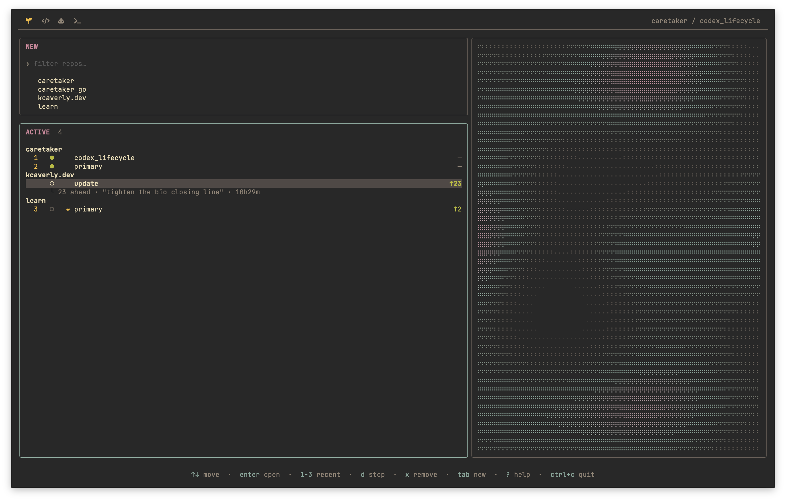
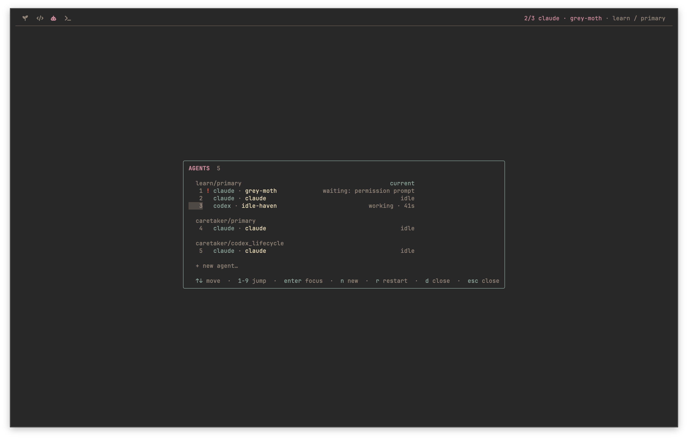
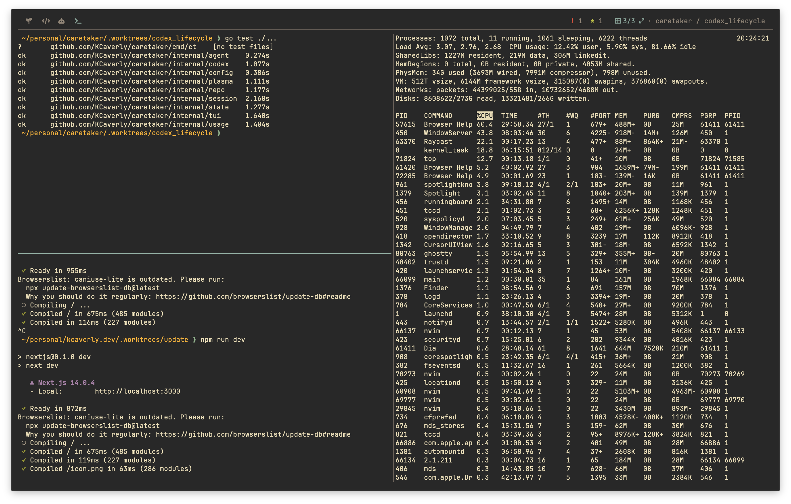
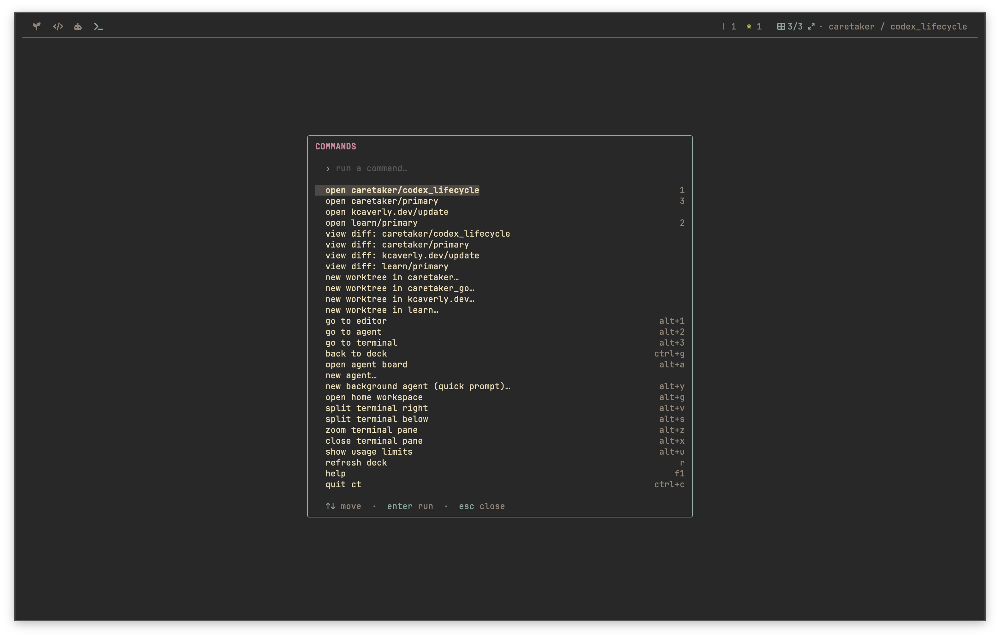

# ct

A terminal "deck" for managing git worktrees across your repos. Each worktree gets a
**workspace** — an nvim window, one or more Claude Code or Codex agents, and a terminal — hosted
*inside* ct under a pinned status bar, with one session full-screen at a time.

Built with [Bubble Tea](https://charm.land/bubbletea) v2 and [charmbracelet/x/vt](https://github.com/charmbracelet/x).



## At a glance

### One agent board

Run Claude and Codex side by side, see what needs attention, and jump between agents across every
active worktree.



### Persistent terminal panes

Split, focus, and zoom terminals while tests, servers, and monitoring tools keep running.



### Everything is discoverable

Search every action and see its current configurable shortcut without leaving the workspace.



## Requirements

- Go 1.25+
- `git` and your configured editor (`nvim` by default) on `PATH`
- The CLI for every enabled agent provider on `PATH` and already authenticated:
  [Claude Code](https://docs.anthropic.com/en/docs/claude-code) and/or
  [Codex](https://github.com/openai/codex)
- Codex integration uses the experimental remote/App Server interface and is tested with
  `codex-cli 0.144.4`; use that version or newer

## Configuration

`ct` reads `~/.caretaker/config.toml`, or the path in `CT_CONFIG`. Only `root` is required:

```toml
# Parent directory containing your repos (each immediate child with a .git).
root = "~/code"

# Optional program defaults:
editor = "nvim"
shell  = "/bin/zsh" # defaults to the current $SHELL when omitted

# Where new worktrees and their branches are created ({name} is the worktree name).
worktree_path = ".worktrees/{name}"
branch_name   = "{name}"

# Both providers are enabled by default, with Claude initially selected, so
# this whole section may be omitted. `default` must also appear in `enabled`.
[agents]
default = "claude"
enabled = ["claude", "codex"]

[agents.claude]
command = "claude"
args = []

[agents.codex]
command = "codex"
args = []

# Reserved navigation keys (not forwarded to embedded sessions).
# Defaults use alt (option-as-meta) chords so they don't collide with the
# programs running inside the panes (LazyVim, zsh, Claude Code, Codex); every key is
# overridable, and an empty string ("") disables one.
[keys]
cycle      = "alt+]"   # next session view (wraps)
cycle_back = "alt+["   # previous session view (wraps)
goto_editor = "alt+1"  # jump to the editor view
goto_agent  = "alt+2"  # jump to the agent view
goto_term   = "alt+3"  # jump to the terminal view
picker      = "ctrl+g" # return to the CT picker
palette     = "alt+a"  # agent board: focus, create, restart, or close agents
next_agent  = "f4"     # next agent in the active worktree
prev_agent  = "f3"     # previous agent in the active worktree
global_config = "alt+g" # open the home-directory workspace
prompt      = "alt+y"  # new-agent form, pre-set to background + home
attention   = "alt+n"  # jump to the agent needing attention (cycles on repeat)
usage       = "alt+u"  # plan usage for enabled agent providers
help        = "f1"     # toggle the key/legend overlay (also "?" in the deck)
command_palette = "alt+p" # fuzzy-searchable list of every action + its key

# Terminal-screen-only pane keys.
term_split_v    = "alt+v"  # new pane to the right
term_split_h    = "alt+s"  # new pane below
term_zoom       = "alt+z"  # zoom / restore the focused pane
term_close      = "alt+x"  # close the focused pane
term_focus_left = "alt+h"  # directional pane focus (h/j/k/l)
term_focus_down = "alt+j"
term_focus_up   = "alt+k"
term_focus_right = "alt+l"

# Ambient plasma panel on the right of the deck (defaults shown). It only
# animates while the deck is on screen, and hides itself on terminals too
# narrow to split.
[plasma]
pattern = "classic" # classic | waves | interference | lava | ripple
palette = "aurora"  # aurora (blue/purple) | ember (yellow/red) | mono (grayscale)
charset = "dots"    # dots (braille) | shade | blocks
speed   = 0.3       # animation rate; 0 freezes the pattern
width   = 40        # percent of the terminal width; 0 disables the panel
```

The old top-level `agent = "claude"` setting is still accepted as a Claude command override.
New configurations should use `[agents.claude]` instead. `command` is the executable and `args`
is a list of base arguments inserted immediately after it, which also supports wrappers:

```toml
[agents]
default = "codex"
enabled = ["codex"]

[agents.codex]
command = "mise"
args = ["exec", "--", "codex"]
```

## Run

```sh
go run ./cmd/ct
# or
go build -o ct ./cmd/ct && ./ct
```

## How it works

A pinned status bar sits at the top at all times:

The bar is a row of spaced **Nerd Font** glyphs (a Nerd Font is required). The caretaker is a
seedling, lit yellow while you tend the deck and dim once you drop into a session; the nvim (code),
agent (robot), and term (terminal) icons glow in their own colour when active and dim otherwise
(faint until a workspace exists). Lifecycle status comes from `claude agents --json` for Claude
and structured App Server events for Codex. When an agent is waiting on your input, the `! N` badge
on the right signals it, and completed agents are promoted in the agent board. The active repo /
worktree shows on the right.

- **Picker** (seedling): the deck — a `NEW` repo fuzzy-finder and an `ACTIVE` list of your
  worktrees grouped by repo (`●` running · `○` stopped · `✷` uncommitted changes). Within each
  repo, worktrees are ordered by when you last opened them in ct (most recent first), falling
  back to git commit time for ones you haven't opened yet. The three most-recently-opened
  worktrees overall get a `1`/`2`/`3` rank in the left column. Each row also shows how far its
  branch is ahead/behind the repo's main branch (`↑N ↓M`, right-aligned), and the selected row
  expands a `└` detail line with the divergence, uncommitted diffstat, last commit subject, and
  age. Last-opened times are persisted to
  `$XDG_STATE_HOME/ct/state.json` (default `~/.local/state/ct/state.json`).
- Pressing **enter** on a worktree **activates** it: ct starts nvim + an agent from
  `agents.default` + a terminal in that worktree and drops you into the nvim view. The session
  segments light up and the active repo / worktree shows on the right. You can also **click** a
  deck row to select it and click it again to open it (or, in `NEW`, to start naming a worktree).
- **`alt+]`** / **`alt+[`** cycle the session views forward / backward
  (nvim → agent → terminal → nvim, wrapping), and **`alt+1`/`alt+2`/`alt+3`** jump straight to
  the editor, agent, or terminal view. **`ctrl+g`** returns to the picker — and from the picker,
  **`ctrl+g`** jumps straight to your most recently opened worktree, so it toggles you between the
  deck and your latest work. You can also **click** any of the four bar icons to jump straight to
  that view (the session icons are inert until a workspace is active). Sessions keep running —
  switching never relaunches them, and they persist for ct's lifetime.

### Agent providers and lifecycle

Press **`alt+a`** to open the agent board for every active worktree. From there, `n` creates an
agent, `enter` focuses one, `r` restarts it in place, and `d` closes it.

Press **`alt+n`** (from anywhere) to jump straight into the session of the agent that most needs
you — agents waiting on input first, then unread completions — without opening the board; pressing
it again cycles to the next agent needing attention. Clicking the `! N` badge in the status bar does
the same thing. When more than one provider
is enabled, the new-agent form adds a Claude/Codex selector; when only one is enabled, that row is
hidden. Each time the form opens it starts on `agents.default`. Board and status-bar labels include
the provider so mixed pools remain easy to distinguish.

Caretaker passes the form prompt as the CLI's initial prompt. Foreground agents are interactive.
The prompt editor supports multiple lines; press `ctrl+enter` to launch the agent (plain `enter`
adds a new line).
Background Claude agents use Claude Code's permission-skipping mode; background Codex agents use
the `workspace-write` sandbox with approvals disabled, so writes outside the workspace still fail
closed. Codex starts a fresh conversation normally and uses `codex resume <thread-id>` when a known
thread ID is restored.

Each Codex pane also owns a private companion `codex app-server` on a local Unix socket. The stock
Codex TUI connects to it with `--remote` and remains responsible for approvals and user input;
caretaker's passive connection observes thread, turn, waiting, completion, failure, and disconnect
events. This remote/App Server interface is experimental, which is why the Codex CLI version in the
requirements matters.

Agent state records the provider, conversation ID, display label, pool order, and focused agent in
`$XDG_STATE_HOME/ct/state.json` (default `~/.local/state/ct/state.json`). Older state without a
provider is migrated to Claude. On the next activation, ct resumes conversations with stored IDs.
Restart is transactional: ct starts the replacement before swapping it into the same pool position,
so a bad command leaves the current process running.

Fresh Claude sessions receive a caretaker-managed ID immediately. Fresh Codex thread IDs are
assigned by Codex and captured from the pane's App Server as soon as the thread starts. Both are then
persisted and resumed after restarting ct. Restarting an agent from the board preserves its provider,
conversation, label, pool position, and focus. Codex lifecycle events feed the same busy, waiting,
completion, attention, and bell system as Claude; failure of Claude's status poll does not erase
Codex status. The `alt+u` usage panel includes estimates for every enabled provider. The top-bar
gauge follows the focused agent, so a Claude session never shows Codex usage and vice versa.

Picker keys: `tab` switch section · `enter` open · `d` stop · `v` view diff · `x` remove · `r` refresh · `?` help · `ctrl+c` quit.

`x` opens a centered **remove** panel rather than a one-line prompt: it shows the worktree's
divergence and uncommitted diffstat (with a red warning when the tree is dirty) above a vertical
list of options — `remove worktree, keep branch` (the safe default the cursor starts on),
`remove worktree + delete branch` (destructive, red), `view diff first`, and `cancel`. Arrow
keys (or `j`/`k`) move and `enter` fires the highlighted option, while the mnemonics still work
directly, so the old `x` `b` (keep branch) and `x` `y` (delete branch) muscle memory is
unchanged. The quit and stop guards use the same panel, defaulting to `cancel`.

`v` opens a read-only diff of everything the branch carries beyond main (committed + uncommitted;
`u` narrows it to just the uncommitted changes), also offered from the remove panel (`view diff
first`) so you can review a worktree before deleting it — and `x` from the diff loops back to the
panel.

Press **`?`** (in the deck) or **`f1`** (anywhere, including inside a session) for a key + legend
overlay; any key closes it.

Press **`alt+p`** (anywhere) for the **command palette**: a fuzzy-searchable list of every ct action
with its live key shown alongside, so you can run any action — and passively learn its chord —
without memorizing the reserved keys; `enter` runs the selected row, `esc` closes.

## Layout

- `cmd/ct` — the `ct` entrypoint.
- `internal/config` — config loading + defaults.
- `internal/repo` — repo discovery and git worktree operations.
- `internal/session` — hosts programs on ptys with a terminal emulator (`x/vt`) per session.
- `internal/tui` — the Bubble Tea model: status bar, picker, key routing, session rendering.
